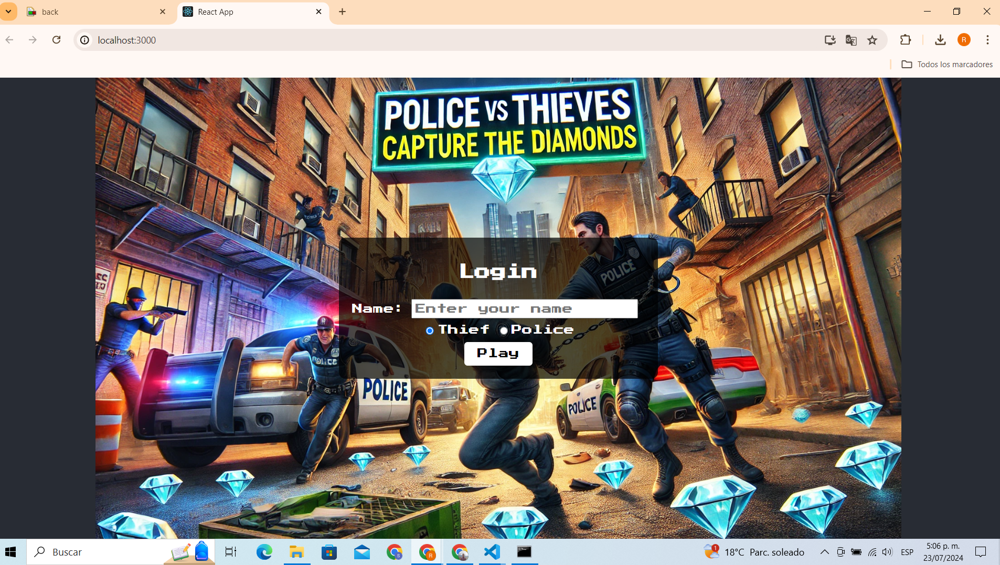
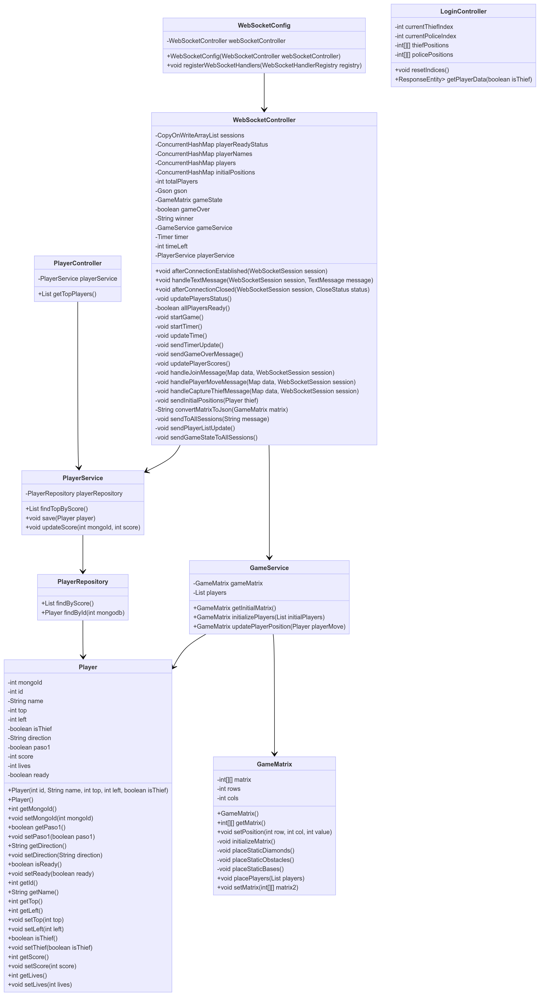
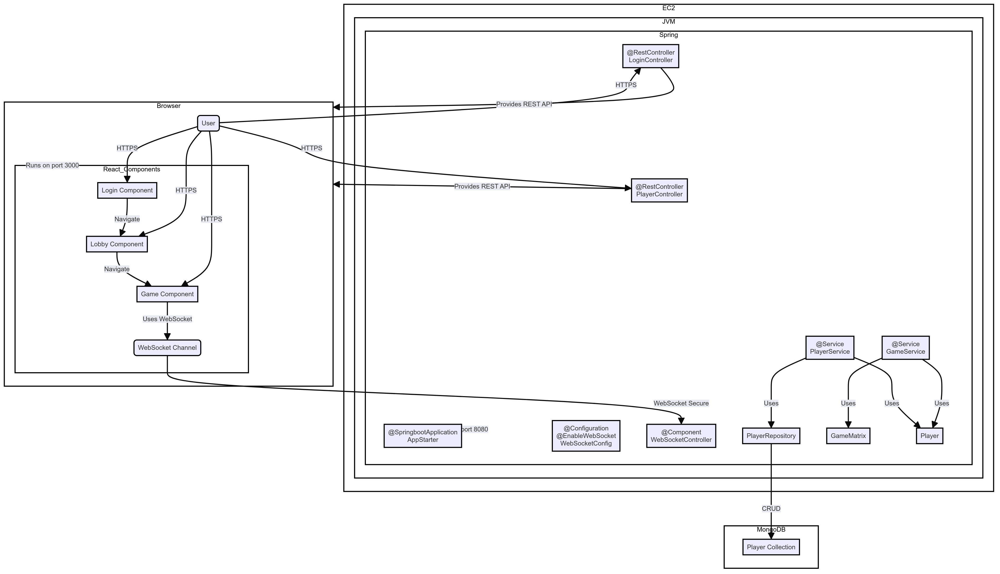
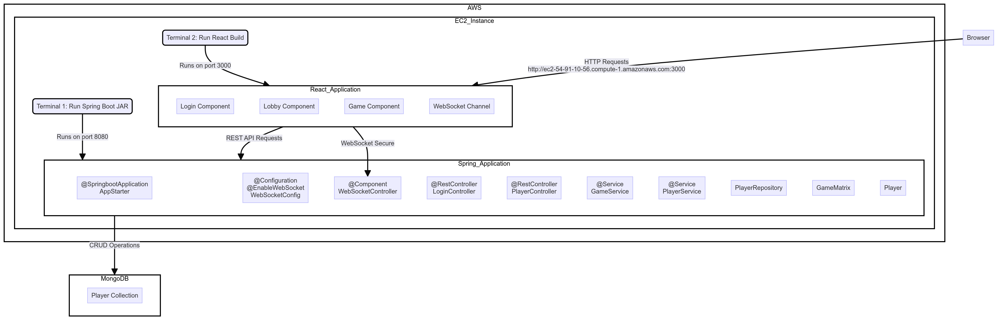

# Project: Police vs. Thieves: Capture the Diamonds

This proyect is a real-time multiplayer game where players are divided into two teams: police and thieves. The objective is to win the match by either eliminating players from the opposing team by handcuffing them (in the case of the police) or capturing the majority of the diamonds located on the track (in the case of the thieves). The game takes place in an obstacle-filled environment.

### Key Features
- **Real-time Multiplayer:** Support for N players divided into two teams.
- **Team Division:** Random or player-selected team assignments.
- **Obstacle-filled Environment:** Track with indestructible obstacles where players can take cover.
- **Eliminations:** Players can handcuff thieves a maximum of 3 times per thief to eliminate opponents, which gives points.
- **Diamond Capture:** Thieves can win by capturing the diamonds on the track, which gives points.
- **Winning the Match:** Thieves can win by capturing the diamonds on the track and police by capturing all the thieves, both within a time limit.
- **Scoring and Ranking System:** Record of player scores and rankings.
## Starting

In order to use the project on your system, you can access the following link and download a compressed file of it.

[Repository](https://github.com/Richi025/police-vs-thieves.git) 

You can also clone the file using the following command.

```
git clone https://github.com/Richi025/police-vs-thieves.git  
```

### Previous requirements

It is necessary to have "**Maven**", "**Java**", "**Node.js**" installed, preferably in their latest versions.

#### Maven
```
Download Maven at http://maven.apache.org/download.html 

Follow the instructions at http://maven.apache.org/download.html#Installation
```
#### Java

```
Download Java at https://www.java.com/es/download/ie_manual.jsp
```

#### Node.js

```
Download Node.js at https://nodejs.org/en
```

### Installing

Once you have the cloned project in your repository. Follow the steps below to launch the program successfully.

#### Run BackEnd Spring-boot

**The application is being implemented**

1. Open a terminal and enter the folder where I clone the repository and enter the BoardSpring folder.

2. Use the following command to compile and clean the target directory.
    ```
    mvn clean compile
    ```
3. Now use the following command to package the project as a JAR file.

    ```
    mvn package
    ```

4. Now you can run the project using the following command.

    ```
    mvn spring-boot:run

    Now the server is running.
    ```

#### Run FrontEnd React Js

1. Open a terminal and enter the folder where I clone the repository and enter the front folder.

2. Use the following command to install dependencies
    ```
    npm install
    ```
3. Now use the following command start proyect

    ```
    npm start
    ```

4. Now there will be a browser and enter the following link and you can start drawing.

    http://localhost:3000/ 

    

## Proyect Structure

### Run BackEnd Spring-boot 

**The application is being implemented**

- GameApplication.java : Main application class for the Spring Boot application.

- Config: 

   - WebSocketConfig: This class enables WebSocket and registers WebSocket handlers.

- Cotroller: 

    - LoginController:  This controller manages player data assignment for thieves and police officers.

    - PlayerController: This controller provides endpoints to retrieve player information.

    - WebSocketController: This class manages player connections, game state, and interactions via WebSocket.
    

- Model: 

    - GameMatrix: This includes initializing the matrix, placing static diamonds, obstacles, and bases.

    - Player: This class manages the player, their attributes, and the methods to request and change these attributes.

- Repository: 

    -   PlayerRepository: This interface provides methods for interacting with the Player collection in MongoDB.

- Service: 

    - GameService: This method finds the player by their ID, updates their position and direction, and then updates the game matrix with the new player positions.
    - PlayerService: This service provides methods to find top players by score, save players, and update player scores.

### Run FrontEnd React Js

- Game.js: Component that handles the game logic and renders the game.

- Lobby.js: Component that displays the game lobby.

- Login.js: Component that handles login.


## Architectural Design

## Class diagram.



## Architecture diagram.



### Diagram Description:

### Browser

- **User**: Represents the user interacting with the application through the browser.
- **Login Component**: React component that handles the login process.
- **Lobby Component**: React component that displays the game lobby.
- **Game Component**: React component that handles game logic.
- **WebSocket Channel**: WebSocket channel used for real-time communication between the client and the server.

### EC2

- **JVM**
- **Spring**
  - **AppStarter**: Main class that starts the Spring Boot application.
  - **WebSocketConfig**: WebSocket configuration to enable and register WebSocket handlers.
  - **WebSocketController**: WebSocket controller that handles WebSocket connections and events.
  - **LoginController**: REST controller that handles login requests and provides player data.
  - **PlayerController**: REST controller that provides endpoints to retrieve player information.
  - **GameService**: Service that handles game logic and player positions.
  - **PlayerService**: Service that manages player-related operations such as saving and updating scores.
  - **PlayerRepository**: Repository that interacts with the MongoDB database to perform CRUD operations on players.
  - **GameMatrix**: Class representing the game matrix and managing the positions of elements in the game.
  - **Player**: Class representing a player in the game.

### MongoDB

- **PlayerData**: Collection in MongoDB that stores player data.

## Deployment diagram.



### Deployment Diagram Description:

### AWS:

#### EC2_Instance:
- **Terminal 1**: Runs the Spring Boot application (JAR) on port 8080.
- **Terminal 2**: Runs the built React application on port 3000.

### Spring_Application:

- **AppStarter**: Main class that starts the Spring Boot application.
- **WebSocketConfig**: WebSocket configuration to enable and register WebSocket handlers.
- **WebSocketController**: WebSocket controller that handles WebSocket connections and events.
- **LoginController**: REST controller that handles login requests and provides player data.
- **PlayerController**: REST controller that provides endpoints to retrieve player information.
- **GameService**: Service that handles game logic and player positions.
- **PlayerService**: Service that manages player-related operations such as saving and updating scores.
- **PlayerRepository**: Repository that interacts with the MongoDB database to perform CRUD operations on players.
- **GameMatrix**: Class representing the game matrix and managing the positions of elements in the game.
- **Player**: Class representing a player in the game.

### React_Application:

- **Login Component**: React component that handles the login process.
- **Lobby Component**: React component that displays the game lobby.
- **Game Component**: React component that handles game logic.
- **WebSocket Channel**: WebSocket channel used for real-time communication between the client and the server.

### MongoDB:

- **PlayerData**: Collection in MongoDB that stores player data.


## Data Flow

+ The user communicates with the React components via HTTP.
+ The React components **(Login, Lobby, Game)** allow navigation and updating the game state.
+ The **Game Component** uses a WebSocket channel **(WSChannel)** to communicate with the **WebSocketController** on the server, ensuring real-time communication.
+ The **REST controllers (LoginController and PlayerController)** provide REST APIs that the React components can use to retrieve and send data.
+ The services **(GameService and PlayerService)** handle game logic and player-related operations.
+ The **PlayerRepository** interacts with the MongoDB database to perform CRUD operations on players.
+ **AppStarter** runs the Spring Boot application on port 8080.
+ **Browser** runs the React components on port 3000.


## AWS

**The application is being implemented**

## Built with

* [Maven](https://maven.apache.org/) - Dependency management
* [Java](https://www.java.com/es/) - Programming language
* [Spring Boot](https://start.spring.io/) - Framework

### Technologies Used
- **Java:** Programming language.
- **Spring Boot:** Framework for building the application.
- **React:** Open-source JavaScript library for building user interfaces.
- **Docker:** Platform for developing, shipping, and running applications in containers.
- **Jacoco:** Code coverage library for Java.
- **SonarQube:** Continuous inspection tool for code quality.

## Versioned

We use [Git](https://github.com/) for version control. For available versions, see the tags in this repository.

## Authors

* **Jose Ricardo Vasquez Vega** - [Richi025](https://github.com/Richi025)

## Date

Wednesday, July 23, 2024

## License

This project is licensed under the GNU license; See the [LICENSE.txt](LICENSE.txt) file for details.